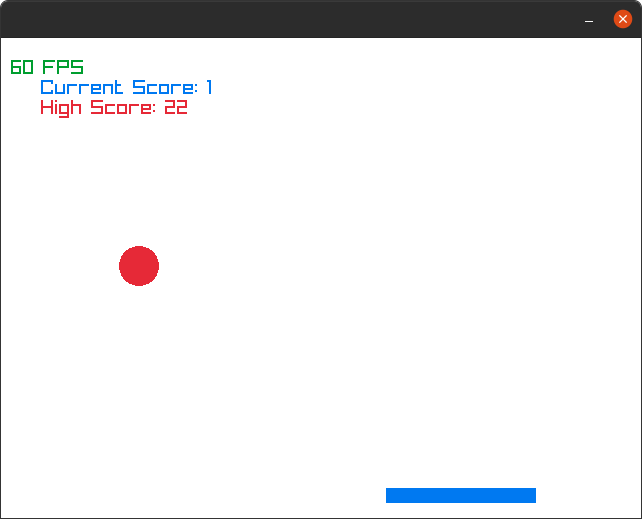

### Pong

A simple, single player variant of pong written with the [Raylib](https://github.com/raysan5/raylib) framework.
### Gameplay
A score counter and high score tracker are contained, and the ball accelerates over time to increase the difficulty.



### Quickstart:
Follow the raylib [install instructions](https://github.com/raysan5/raylib) for your particular device.

```bash
$ make clean
$ make
$ ./run
# Game window should open here!
```

### License

This software is provided as-is, in the hopes that it will be used and/or enjoyed by others.
